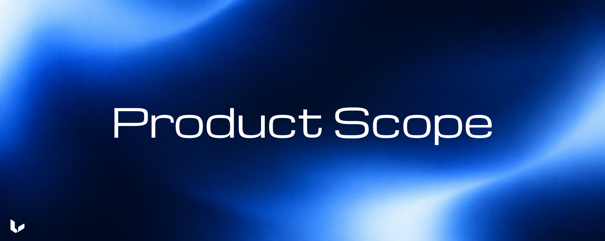

# Product scope

<p align="center">
  
</p>

Urma is a local-first MCP server for acquiring bounded video evidence. It
resolves a source, pins a finite timeline, acquires source-provided captions or
video, validates the result, and records provenance for each investigation.

The MCP host chooses requests, interprets the returned evidence, and decides
whether it supports a conclusion.

## Included in v0.1

### Source admission

- HTTP(S) remote video sources that pass the versioned remote policy and finite
  timeline validation.
- Supported single-video YouTube URLs.
- Local video files whose canonical paths are inside a root listed in
  `URMA_LOCAL_ROOTS`.
- Local `.vtt` or `.srt` caption sidecars. When both exist for a local video,
  the `.vtt` sidecar is selected first.

Remote sources must resolve to one video with a positive finite duration. The
implementation validates progressive/container media, finite HLS media
playlists, and static finite DASH timelines. Multi-entry, live, upcoming,
private, login-required, paywalled, and DRM-protected sources are rejected.

### Evidence acquisition

- `inspect_video` creates an investigation pinned to one source snapshot.
- `search_transcript` performs bounded literal phrase or term matching on one
  selected caption track.
- `read_transcript` returns timestamped caption segments from a bounded
  source-global interval.
- `get_overview` returns a sparse visual locator with up to 12 cells for the
  whole source or a validated interval.
- `get_frames` returns exact JPEG points, ordered sparse burst points, or a
  paged fixed-cadence set of exact point requests.
- Investigation-scoped MCP resources reopen presented artifacts and expose
  persisted investigation state.

The public MCP surface does not expose audio evidence. Urma does not infer
speech from a video that has no supported caption track.

### Distribution and persistence

- npm bootstrap through `urma-mcp`.
- Native Node.js 24 LTS (`>=24 <25`).
- Supported targets: Windows x64/arm64, macOS x64/arm64, and Linux x64/arm64
  with glibc.
- Generation-local FFmpeg, ffprobe, and yt-dlp supplied by the release
  manifest.
- Immutable installation generations with a receipt and an atomic active
  selector.
- SQLite state and a content-addressed blob store under the user-selected
  local data root.
- MCP stdio, read-only doctor checks, and local generation rollback/recovery.

## Host and CLI surface

The npm entry point accepts:

```text
urma setup [--data-dir PATH] [--client generic --config PATH]
urma --version
urma -v
```

The npm entry point starts MCP stdio only after the persistent runtime has been
selected. The persistent `launcher-v1.mjs` starts that runtime and accepts
`doctor`, `rollback`, and `recover`. Run those commands through the launcher
with the Node executable and data root selected by setup. `setup` must run from
the npm release; the launcher rejects it.

Setup can register a generic JSON host entry. Registration uses the absolute
Node executable recorded by setup, the absolute `launcher-v1.mjs` path, and
the selected `URMA_DATA_DIR`. It preserves unrelated `mcpServers` entries.

Normal MCP startup is local. It does not invoke npm, update the installation,
look up native tools through `PATH`, or check provider freshness. A later setup
selects a generation for later processes; an already running process retains
the generation it loaded.

## Excluded from v0.1

Urma v0.1 does not include:

- speech-to-text or other audio transcription;
- OCR, object recognition, action recognition, optical-flow analysis, learned
  scene understanding, or visual-language model calls;
- embeddings, vector search, RAG, semantic ranking, similarity search, or
  automatic evidence selection;
- internal LLM calls, agents, planners, or answer summarization;
- continuous video streaming, live or upcoming streams, playlist or collection
  selection, or multi-entry source handling;
- login, private, subscription-only, paywalled, or DRM-protected media;
- comments, social-platform data, arbitrary HTTP serving, accounts, workspaces,
  collections, or dashboards;
- cloud synchronization, hosted multi-tenant isolation, external databases, or
  background indexing;
- persistent telemetry or analytics;
- a Node.js installer, system package manager, Docker runtime, PATH modifier,
  background updater, or independent yt-dlp update channel.

Opt-in development diagnostics are available on stderr through `URMA_DEBUG`.
They can also be appended to a caller-selected JSONL file with
`URMA_DEBUG_FILE` when `URMA_DEBUG` is enabled.

## Scope boundary

For a proposed MCP operation, specify its inputs, returned evidence, limits,
errors, and what the result cannot establish.
