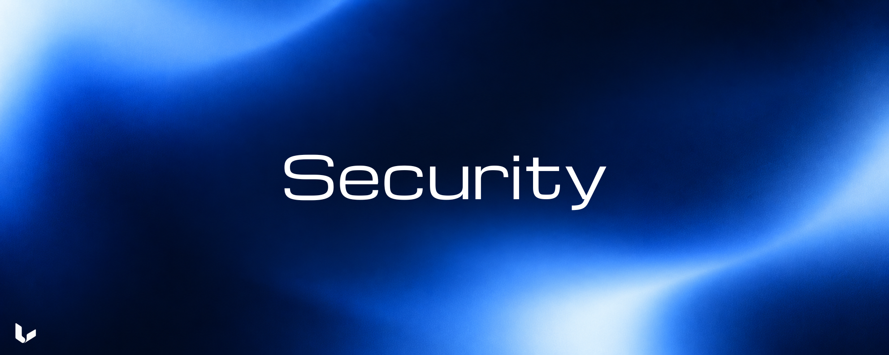

# Security

  

Urma's controls assume one user, local Node.js, generation-local native
executables, and a trusted operating system. They are not an operating-system
sandbox against a compromised Node process or native executable.

## Local file boundary

Local input is disabled until `URMA_LOCAL_ROOTS` contains one or more allowed
roots. For a local video or caption sidecar, Urma:

1. resolves the requested path and each configured root;
2. resolves symlinks or junctions to canonical paths;
3. checks that the canonical file remains inside a canonical allowed root; and
4. requires a regular file.

UNC and network paths are rejected for local input unless `URMA_ALLOW_UNC` is
set to `1` or `true`. Allowing UNC input does not remove the configured-root
check. The persistent Urma data root always has to be a user-owned local
filesystem path.

A local caption sidecar is looked up beside the video as `<basename>.vtt`, then
`<basename>.srt`. The selected sidecar passes through the same canonical-root
check and is pinned with the local video content.

Canonical local paths are used internally to resolve and identify a source.
The public source reference is an opaque hash, and the MCP projection does not
return the canonical local path.

## Installation integrity

`setup` is transactional:

- The release manifest identifies the target, artifact URL, archive hash,
  expected contents, binary identity, capability data, and licensing data.
- Archive hashes are checked before extraction.
- Extraction rejects absolute paths, drive paths, UNC paths, traversal,
  unsafe names, duplicate entries, case-colliding entries, and symlink escapes.
- The staged generation is kept on the installation filesystem and is not
  selected until the runtime, native tools, receipt, and persisted-runtime MCP
  smoke test pass.
- The generation receipt records the installed runtime, native-tool hashes,
  target, policy data, qualification checks, and provenance hashes.
- The active selector is written to a temporary file, flushed, and atomically
  renamed into place.
- Setup operations use an installation lock and do not overwrite an active
  generation in place.

If a later setup fails, the current active selector remains in use. A retained
previous generation can be selected by `rollback` after its integrity and
persistent-state compatibility checks pass. `recover` restores the selector
stored in `ACTIVE.backup.json`.

## Runtime integrity

The launcher validates:

- Node.js 24 and the executing platform target;
- the active selector and generation containment;
- the generation receipt and state schema version;
- the runtime entry and native-tool paths inside the selected generation,
  together with the recorded Node executable and execution architecture; and
- regular-file requirements.

The runtime does not discover FFmpeg, ffprobe, or yt-dlp through `PATH`. Before
each native tool is first used in a process, Urma verifies its installed file
against the receipt hash. The result is cached for that process. A missing or
modified executable fails the operation; there is no system-binary fallback.

The receipt records installation provenance; native-tool hash verification
happens on first use in each process.

## Remote URL and network boundary

Remote input and every remote subresource must use HTTP or HTTPS, contain no
userinfo, and use the protocol's default port. Local and non-public hostnames
are rejected. Literal and DNS-resolved addresses are checked against private,
local, metadata, carrier-grade, link-local, unspecified, multicast,
documentation, ULA, private IPv4-mapped, and other reserved address ranges.

The process-local Safe Proxy listens on `127.0.0.1` and an ephemeral port. It
supports HTTP forwarding and HTTPS `CONNECT` without terminating TLS. For each
connection it:

1. parses and checks the URL;
2. resolves the hostname itself when needed;
3. validates every returned address; and
4. dials the selected validated address directly.

The same path is used again for redirects, delivery URLs, HLS or DASH
manifests and fragments, caption URLs, and storyboard URLs. A hostname that
was accepted for one request does not authorize a different resolved address.

The source policy also rejects non-video result classes, multi-entry results,
search/channel/playlist-style extractor results, live or upcoming sources,
authentication-required or paywalled sources, DRM-protected sources, and
metadata that exposes no video representation. Finite timeline validation then
rejects changing HLS or DASH timelines and media without a positive finite
duration.

Provider delivery URLs are transient acquisition data. They are not included
in model-facing source or artifact records. The public source identity is a
versioned source reference, not a delivery URL.

The Safe Proxy is an application-level SSRF boundary for this local threat
model. A trusted executable can bypass application checks by opening its own
network connection; preventing that requires operating-system or
infrastructure isolation outside this package.

## Subprocess controls

Urma starts native tools with argument arrays, `shell: false`, hidden child
windows on Windows, and process-tree cleanup on timeout or cancellation.

Child environments are allowlisted. They do not inherit credentials, browser
profiles, proxy variables, runtime hooks, or arbitrary application state.
yt-dlp is invoked with an internal profile that disables configuration files,
plugins, cookies, external execution, cache, remote components, updates,
playlist expansion, and uncontrolled retries or concurrency. Its JavaScript
runtime and FFmpeg location are supplied from the selected generation.

Remote FFmpeg and ffprobe inputs receive the Safe Proxy explicitly and use the
restricted protocol set `http,https,tcp,tls,httpproxy`. HTTP(S) operations
cannot opt out of the proxy through a caller-provided option.

The subprocess runner bounds stdout and stderr, enforces deadlines, and reports
timeouts, cancellation, output-limit breaches, and non-zero exits as explicit
errors. A failed subprocess does not become a successful acquisition.

## Acquisition and cache safety

Remote output is bounded while it is written. Targeted media, navigation media,
reusable evidence media, and remote acquisition wall time have separate
ceilings. Exceeding a ceiling terminates the process tree, removes temporary
acquisition data, and prevents a successful cache record.

Media must pass video-stream, duration, timing, and size validation before it
is promoted. JPEG output is checked for valid markers. Caption data is parsed
before its database transaction; an individual caption cue above the response
ceiling is rejected.

Artifacts are stored by SHA-256. Blob writes use temporary files and atomic
promotion. Reads verify the expected content-addressed path, size, and hash.
Resource reads fail if an artifact is missing or corrupt. Acquisition paths
can reacquire invalid cached artifacts; reopening a resource does not itself
trigger acquisition.

Equivalent acquisitions share one in-flight operation. Each caller can cancel
independently. Cancelling one caller does not cancel shared work
still needed by another; shared work stops after the last observer detaches.

## Model-facing data boundary

MCP errors expose a normalized code, retryability flag, and redacted detail.
URL-shaped diagnostics and local path patterns are redacted before they are
returned in model-facing error text. Structured tool projections omit internal
transport fields and raw resolver metadata.

Caption text, media, metadata, and images are untrusted source data. Urma
returns them as evidence data, not instructions for the host. Provider metadata
can supply delivery and caption URLs; those URLs pass through the remote
policy and network checks. The host must keep source content separate from
instructions when interpreting the evidence.

An artifact resource can be read only after the artifact has been presented to
the requesting investigation. A cached artifact, an artifact presented to a
different investigation, or a guessed hash does not bypass that authorization.

`URMA_DEBUG` and `URMA_DEBUG_FILE` are opt-in developer diagnostics. A caller
that enables them is responsible for protecting the selected debug file and
its operational records.

## Boundary of these controls

Investigation-scoped resource checks track presented evidence; they do not
isolate different users. Urma has no authentication or hosted multi-tenant
isolation. Source admission and media validation do not establish that captions
are truthful or that a video is appropriate to display.
